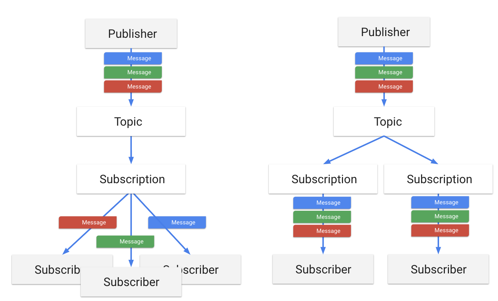

# GCP Pub/Sub

## Sources

* [Overview](https://cloud.google.com/pubsub/docs/overview)
* [Quotas](https://cloud.google.com/pubsub/quotas)

## Core Concepts

* __Topic__: A named resource to which messages are sent by publishers.
* __Subscription__: A named resource representing the stream of messages from a single, specific topic, to be delivered to the subscribing application.
* __Message__: The combination of data and (optional) attributes that a publisher sends to a topic and is eventually delivered to subscribers.
* __Message attribute__: A key-value pair that a publisher can define for a message. For example, key `iana.org/language_tag` and value `en` could be added to messages to mark them as readable by an English-speaking subscriber.
* __Publisher__ : An application that creates and sends messages to a topic(s).
* __Subscriber__ : An application with a subscription to a topic(s) to receive messages from it.
* __Acknowledgement__: ("ack") A signal sent by a subscriber to Pub/Sub after it has received a message successfully. Acked messages are removed from the subscription's message queue.
* __Push and pull__: The two message delivery methods. A subscriber receives messages either by Pub/Sub pushing them to the subscriber's chosen endpoint, or by the subscriber pulling them from the service.

## Publish-Subscriber Relation

* Many-to-one
* One-to-many
* Many-to-many

