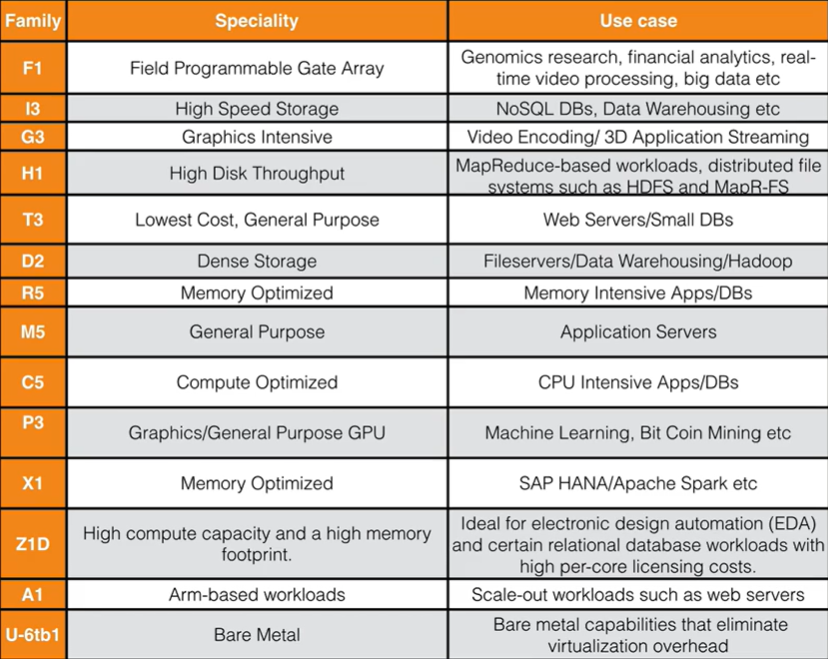
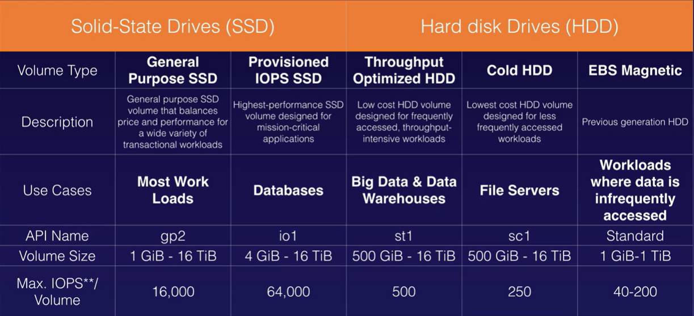
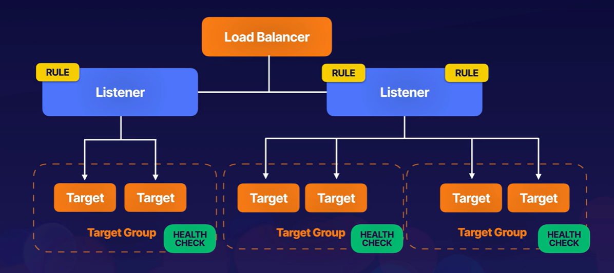
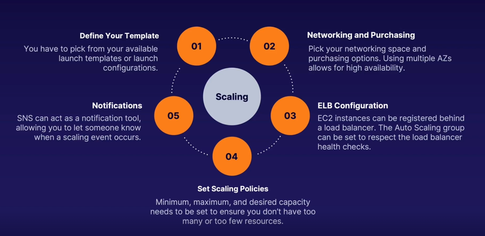

- [SAA-C03](#saa-c03)
- [Main Topics](#main-topics)
- [Whitepapers](#whitepapers)
- [IAM](#iam)
  - [ARN](#arn)
  - [Users](#users)
  - [Policies](#policies)
  - [Roles](#roles)
- [CloudWatch](#cloudwatch)
- [S3](#s3)
  - [Data Consistency](#data-consistency)
  - [Features](#features)
  - [Storage Classes](#storage-classes)
  - [Charges](#charges)
  - [Encryption](#encryption)
  - [Versioning](#versioning)
  - [Lifecycle Rules](#lifecycle-rules)
  - [Object Lock](#object-lock)
  - [Performance](#performance)
  - [Other Features](#other-features)
  - [Sharing buckets across accounts](#sharing-buckets-across-accounts)
  - [Cross region replication](#cross-region-replication)
  - [Transfer Acceleration](#transfer-acceleration)
- [CloudFront](#cloudfront)
  - [Signed URLs and Cookies](#signed-urls-and-cookies)
- [Snowball](#snowball)
- [Storage Gateway](#storage-gateway)
- [S3 Select vs. Athena](#s3-select-vs-athena)
- [EC2](#ec2)
  - [AMI](#ami)
  - [Security Groups](#security-groups)
  - [EBS](#ebs)
    - [Snapshots](#snapshots)
  - [Instance Store](#instance-store)
  - [EBS vs. Instance Store](#ebs-vs-instance-store)
  - [EFS](#efs)
  - [Migrate an EC2 instance from one AZ to another](#migrate-an-ec2-instance-from-one-az-to-another)
  - [EC2 Placement Groups](#ec2-placement-groups)
  - [Spot Instances](#spot-instances)
- [Amazon FSx](#amazon-fsx)
- [ENI vs. ENA vs. EFA](#eni-vs-ena-vs-efa)
- [CloudWatch](#cloudwatch-1)
  - [CloudWatch Logs](#cloudwatch-logs)
- [CloudTrail](#cloudtrail)
- [HPC on AWS](#hpc-on-aws)
- [WAF](#waf)
- [RDS](#rds)
  - [DynamoDB](#dynamodb)
    - [DAX](#dax)
  - [DMS](#dms)
  - [RedShift](#redshift)
  - [Aurora](#aurora)
  - [ElastiCache](#elasticache)
- [Caching Strategies](#caching-strategies)
- [Amazon EMR](#amazon-emr)
- [AWS Directory Service](#aws-directory-service)
- [Amazon Resource Access Manager](#amazon-resource-access-manager)
- [AWS IAM Identity Center](#aws-iam-identity-center)
- [Route 53](#route-53)
  - [Policies](#policies-1)
  - [Common DNS Record Types](#common-dns-record-types)
- [VPC](#vpc)
  - [VPC Peering](#vpc-peering)
  - [AWS Private Link](#aws-private-link)
  - [Transit Gateway](#transit-gateway)
  - [VPC Endpoints](#vpc-endpoints)
  - [Global Accelerator](#global-accelerator)
    - [Components](#components)
  - [NAT Gateways](#nat-gateways)
  - [NACLs](#nacls)
  - [Flow Log](#flow-log)
  - [Bastion Host](#bastion-host)
  - [Direct Connect](#direct-connect)
- [ELBs](#elbs)
  - [Health Checks](#health-checks)
  - [Application Load Balancer](#application-load-balancer)
  - [Other Concepts](#other-concepts)
- [High Availability](#high-availability)
  - [The 3 W of Scaling](#the-3-w-of-scaling)
  - [Launch Templates](#launch-templates)
  - [AWS Auto Scaling](#aws-auto-scaling)
    - [Types of Scaling](#types-of-scaling)
  - [Relational Database Scaling](#relational-database-scaling)
- [SQS](#sqs)
- [SNS](#sns)
- [API Gateway](#api-gateway)
- [AWS Batch](#aws-batch)
- [Amazon MQ](#amazon-mq)
- [AWS Step Functions](#aws-step-functions)
- [AppFlow](#appflow)
- [Big Data](#big-data)
  - [Redshift](#redshift-1)
  - [EMR](#emr)
  - [Kinesis](#kinesis)
  - [Athena vs. Glue](#athena-vs-glue)
  - [QuickSight](#quicksight)
  - [AWS Data Pipeline](#aws-data-pipeline)
    - [Components](#components-1)
  - [Amazon MSK](#amazon-msk)
  - [Amazon OpenSearch](#amazon-opensearch)

# SAA-C03

> AWS Solutions Architect Associate

Links

* [Certification](https://aws.amazon.com/certification/certified-solutions-architect-associate/)
* [Exam Guide](https://d1.awsstatic.com/training-and-certification/docs-sa-assoc/AWS-Certified-Solutions-Architect-Associate_Exam-Guide.pdf)
* [Sample Questions](https://d1.awsstatic.com/training-and-certification/docs-sa-assoc/AWS-Certified-Solutions-Architect-Associate_Sample-Questions.pdf)
* [Practice](https://explore.skillbuilder.aws/learn/course/external/view/elearning/13266/aws-certified-solutions-architect-associate-official-practice-question-set-saa-c03-english?saa=sec&sec=prep)

Sources to study

* [freeCodeCamp](https://www.youtube.com/watch?v=Ia-UEYYR44s&ab_channel=freeCodeCamp.org)
* [Whitepapers](https://aws.amazon.com/whitepapers/)
* [FAQs](https://aws.amazon.com/faqs/)
* [Cheat Sheets](https://tutorialsdojo.com/aws-cheat-sheets/)
* [AWS Cloud Architecture for Web Hosting](https://docs.aws.amazon.com/whitepapers/latest/web-application-hosting-best-practices/an-aws-cloud-architecture-for-web-hosting.html)

Exam Domains

* 26% - Design Resilient Architectures
* 24% - Design High-Performing Architectures
* 30% - Design Secure Architectures
* 20% - Design Cost-Optimized Architectures

# Main Topics

* **Compute**
  * EC2
  * Lambda
  * Elastic Beanstalk
* **Storage**
  * S3
  * EBS
  * EFS
  * FSx
  * Storage Gateway
* **Databases**
  * RDS
  * DynamoDB
  * Redshift
* **Networking**
  * VPCs
  * Direct Connect
  * Route 53
  * API Gateway
  * AWS Global Accelerator

# Whitepapers

* AWS Security Best Practices
* AWS Well-Architected Framework
* Architecting for the Cloud AWS Best Practices
* Practicing Continuous Integration and Continuous Delivery on AWS Accelerating Software Delivery with DevOps
* Microservices on AWS
* Serverless Architectures with AWS Lambda
* Optimizing Enterprise Economics with Serverless Architectures
* Running Containerized Microservices on AWS
* Blue/Green Deployments on AWS

# IAM

> To access the console you use an account and password combination. To access AWS programmatically you use a Key and Secret Key combination

* Users
* Groups
* Policies
* Roles
* IAM Entity: a User or Role

[Best Practices](https://docs.aws.amazon.com/IAM/latest/UserGuide/best-practices.html)

## ARN

[Link](https://docs.aws.amazon.com/general/latest/gr/aws-arns-and-namespaces.html)

> Amazon Resource Name

* Uniquely identifies a resource in AWS
  * `arn:partition:service:region:account-id:resource-id`
  * `arn:partition:service:region:account-id:resource-type/resource-id`
  * `arn:partition:service:region:account-id:resource-type:resource-id`
  * Examples:
  * `arn:aws:iam::123456789012:user/mark`
  * `arn:aws:s3:::my_bucket/image.png`
  * `arn:aws:ec2:us-east-1:123456789012:instance/*`

## Users

[Link](https://docs.aws.amazon.com/IAM/latest/UserGuide/id_users.html)

> An identity within AWS that has specific permissions for a single person or application

* Best practices recommends relying more on temporary credentials instead of creating IAM users with long-term credentials
* Console password
* Access Keys

## Policies

[Link](https://docs.aws.amazon.com/IAM/latest/UserGuide/access_policies.html)

* Identity-based policies
  * Managed
  * Inline
* Resource-based policies
* Permission boundaries
* Organizations SCPs
* Access Control Lists (ACLs)
* Session Policies

## Roles

* An aggregation of applied Policies

# CloudWatch

> Monitor AWS resources in real time

* Alarms
* Logs
* Metrics

# S3

> Simple Storage Services

* Object-based
  * Key: name of the object
  * Value: data, a sequence of bytes
  * Version ID: versioning
  * Metadata
  * Sub-resources
    * Access Control Lists
    * Torrents
* Bucket: a folder to store data
  * Names must be globally unique (across users, per region)
  * This generates a unique URL for manipulating the data

## Data Consistency

* Read after Write: immediate read is possible after write
* Eventual consistency for update (new version) and delete
* 99.9% availability
* 11x 9s for durability

## Features

* Tiered Storage
* Lifecycle Management
* Versioning
* Encryption
* MFA for delete
* ACL and Bucket Policies

## Storage Classes

[Link](https://aws.amazon.com/s3/storage-classes/)

* S3 Standard
* S3 Intelligent-Tiering
* S3 Standard-IA
* S3 One Zone-IA
* S3 Glacier Instant Retrieval
* S3 Glacier Flexible
* S3 Glacier Deep Archive
* S3 Outposts

## Charges

* Storage
* Requests
* Storage Management
* Data Transfer
* Transfer Acceleration
* Cross Region Replication

## Encryption

* In Transit
  * SSL/TLS
* At Rest
  * Server-side: SSE-S3, SSE-KMS, SSE-C
  * Client-side (you encrypt before storing)

## Versioning

* Stores all versions of an object
* Once enabled, can't be disabled, only suspended

## Lifecycle Rules

* Transition Actions (between storage classes)
* Expiration Actions (deletes objects)

## Object Lock

> Write once, read many (WORM)

Can be applied to a bucket or objects

* Governance Mode
  * Few users can be delete objects
* Compliance Mode
  * No user can delete objects, even the root user
* Retention period
* Legal Holds

## Performance

> mybucketname/folder1/subfolder1/filename.ext

Prefix: `/folder1/subfolder1/`

* Requests per prefix per second:
  * 3500 PUT/COPY/POST/DELETE
  * 5500 GET/HEAD
* Spread data across prefixes for better performance
* KMS has performance hard limits
* Multipart Upload
  * Recommended for files above 100 MB
  * Required for files above 5 GB

## Other Features

* S3 Select
  * Select data via SQL
* Glacier Select
  * SQL queries against Glacier directly

## Sharing buckets across accounts

* Bucket Policies & IAM
* ACLs & IAM
* Cross-account IAM Roles

## Cross region replication

* Destination bucket must enable versioning
* Replication starts for new versions of objects the moment you turn it on
* Permissions aren't replicated to the destination bucket
* Delete markers or deleting individual versions are not replicated

## Transfer Acceleration

> Uses CloudFront Edge Network to accelerate uploads to S3

# CloudFront

> Is a CDN (Content Delivery Network)

* **Edge Locations**
* **Origin** - the origin of all files the CDN will distribute
  * S3 bucket
  * EC2 instance
  * Elastic Load Balancer
  * Route 53
  * **OAI** - Origin Access Identity
* **Distribution** - Collection of Edge Locations and settings
  * Web Distribution
  * RTMP (media streaming)
  * **Invalidations** - Invalidate objects, directories
* **TTL** (time-to-live)
  * Cache can be cleared

##  Signed URLs and Cookies

* One Signed URL -> One File
* One Signed Cookie -> Multiple Files
* Limited lifetime
* Issues a request as the IAM user who creates the presigned URL
* Origin
  * EC2 - use CloudFront
  * S3 - Use S3 Signed URL

# Snowball

> Migrate data at petabyte-scale

* Import and export to S3

# Storage Gateway

> A service that connects on-premises software to cloud-based storage and provides seamless integration between the two environments

* File Gateway (NFS & SMB)
* Volume Gateway (iSCSI)
* Tape Gateway (VTL)

# S3 Select vs. Athena

* S3 Select is geared more towards structure data
  * Select a subset data from a single object
* Athena is a geared more towards big data
  * Define tables that represent many S3 objects
  * Aggregations, joins, filters
* Macie - Helps identify PII (Personal Identifiable Information)

# EC2

> Hypervisor Nitro

[Link](https://aws.amazon.com/ec2/)

* [Pricing Models](https://aws.amazon.com/ec2/pricing/)
  * On demand
    * Low cost and flexibility
    * Short term, spikes or unpredictable workloads
    * Development and testing
  * Reserved
    * Steady state and usage
    * Reserved capacity
      * Standard Reserved Instances (75% off on demand)
      * Convertible Reserved Instances (up to 54% off on demand)
      * Scheduled Reserved Instances
  * Spot
    * Flexible start and end times
    * Low compute prices
  * Dedicated Hosts
    * Regulatory requirements
    * Purchased on-demand
* [Types of instances](https://aws.amazon.com/ec2/instance-types/)

## AMI

[Link](https://docs.aws.amazon.com/AWSEC2/latest/UserGuide/AMIs.html)

> Amazon Machine Image

Contains:

* Information required to launch an instance.
* One or more EBS or a template for the root volume
* Launch permissions
* A block device mapping

Configuration

* Region
* OS
* Architecture
* Launch Permissions
* Storage
  * EBS
  * Instance Store

## Security Groups

> Instance Level Firewall

[Link](https://docs.aws.amazon.com/AWSEC2/latest/UserGuide/ec2-security-groups.html)

* All traffic is blocked by default
* All outbound traffic is allowed
* Rule changes take effect immediately
* Security Groups are stateful
* EC2 Instances and Security Groups are a many-to-many relationship

## EBS

[Link](https://docs.aws.amazon.com/AWSEC2/latest/UserGuide/AmazonEBS.html)

> Elastic Block Store

* [Root Device Volume](https://docs.aws.amazon.com/AWSEC2/latest/UserGuide/RootDeviceStorage.html) contains the image used to boot an instance
* Volumes are in the same AZ as Instances
* Volumes can be deleted on termination of Instances or not
* Volumes can be modified on the fly, even root ones

[Types](https://docs.aws.amazon.com/AWSEC2/latest/UserGuide/ebs-volume-types.html)

* General Purpose (SSD)
* Provisioned IOPS (SSD)
* Throughput Optimised HDD
* Cold HDD
* Magnetic

### Snapshots

> Snapshots of EBS are incremental backups that are stored in S3

* Used to create AMIs
* Copy and share snapshots
* Create EBS volumes from a snapshot

## Instance Store

> Ideal for temporary information that changes frequently

* Ephemeral Storage
* If the underlying instance fails, you loose all data
* Instances with Instance Store can't be stopped
* Rebooting doesn't lose your data

## EBS vs. Instance Store

* **EBS Volume** is network attached drive which results in slow performance but data is persistent meaning even if you reboot the instance data will be there
* **Instance Store** provides temporary block-level storage for your instance. This storage is located on disks that are physically attached to the host computer

## EFS

> Amazon Elastic File System

* Elastic storage capacity
* Share files between EC2 instances
* Thousands of concurrent NFS connections
* Data is stored across multiple AZs within a region
* Read after write consistency

## Migrate an EC2 instance from one AZ to another

1. Create a snapshot of the instance
2. Create an AMI from the snapshot
3. Instantiate an instance from the AMI

To migrate to another Region, just copy the AMI from one Region to another and instantiate instances from there. To create a snapshot of a root device, it is best practice to stop the instance before taking the snapshot.

## EC2 Placement Groups

* **Cluster**
  * Packs instances close together inside an Availability Zone
  * Enables workloads to achieve the low-latency network performance necessary for tightly-coupled node-to-node communication (e.g. HPC)
* **Partition**
  * Spreads your instances across logical partitions such that groups of instances in one partition do not share the underlying hardware with groups of instances in different partitions
  * Typically used by large distributed and replicated workloads (Hadoop, Cassandra and Kafka)
* **Spread**
  * Strictly places a small group of instances across distinct underlying hardware to reduce correlated failures
  * Can be deployed across AZs

## Spot Instances

* Instance will be provisioned so long as the Spot Price is below a set maximum Spot Price that you set
* **EC2 Hibernate** - Saves the instance's RAM into the EBS root volume and persists any volume attached to the instance
* **Spot Block** - prevent an instance from terminating even if the spot price goes above the maximum
* Instances have a two minute notification before being interrupted or hibernated
* **Spot Fleet** - attempts to launch a collection of Spot Instances and attempts to keep its original capacity if instances are interrupted
* **Spot Instance Advisor** - helps to determine pools with the least chance of interruption

# Amazon FSx

> Amazon FSx makes it easy and cost effective to launch, run, and scale feature-rich, high-performance file systems in the cloud

* NetApp ONTAP
* OpenZFS
* Windows File Server
* Lustre

# ENI vs. ENA vs. EFA

* Elastic Network Interface
  * No high-performance requirement
  * Web servers, DB servers
* Enhanced Networking Adapter
  * High bandwidth and lower inter-instance latency
* Elastic Fabric Adapter
  * OS-bypass, lower latency and higher throughput
  * HPC applications

# CloudWatch

> Monitoring service of most AWS applications

* Create dashboards
* Create alarms
* Create events
* Logs
  * Monitor, store and access log files
  * Query logs and analyze

## CloudWatch Logs

* Log Event
  * A single record, containing a timestamp and data
* Log Stream
  * A collection of Log Events from a single source
* Log Group
  * A collection of Log Streams

**CloudWatch Logs Insights** can use SQL to query Logs

# CloudTrail

> Records AWS Management Console actions and API calls

# HPC on AWS

* EC2
  * Instances optimized for CPU and GPU
  * EC2 Fleets
  * Placement Groups
* Network Networking
  * ENI
  * ENA
  * EFA

# WAF

> Web Application Firewall

* Application-level Firewall (layer 7 of OSI model)
* Monitor HTTP and HTTPS requests forwarded to CloudFront
* Load Balancer
* API Gateway

# RDS

> Relational Database Service

* Runs on Virtual Machines
* Types
  * **Multi-AZ** (Disaster-Recovery)
  * **Read Replicas** (Performance)
* Available relational Databases
  * SQL Server
  * Oracle
  * MySQL
  * PostreSQL
  * Aurora
  * MariaDB
* DynamoDB (NoSQL)
* Redshift OLAP
* ElastiCache
  * Memcached
  * Redis

## DynamoDB

* Spread across 3 geographically distinct data centers
* Eventually Consistent or Strongly Consistent Reads
* Security
  * KMS for encryption at rest
  * Site-to-site VPN
  * Direct Connect (DX)
  * IAM Policies or fine-grained access
* Provisioned vs. On-demand capacity

### DAX

> DynamoDB Accelerator

* In-memory cache
* Compatible with DynamoDB calls
* Global tables

## DMS

> Database Migration Service

* Migrate databases into AWS Cloud
  * Source and target can be in the cloud or on-premise
* Homogeneous and Heterogeneous migrations and data replication
* AWS **Schema Conversion Tool** (SCT): migrate to a different DB Engine

## RedShift

> BI and Data Warehouse

* Single vs Multi-node
* Leader Node and Compute Node
* Advanced Compression (compresses by column)
* MPP (Massive Parallel Processing)
* Backups: 1 to 35 retention period
* Replicate snapshots to S3 in another region

## Aurora

> Amazon's MySQL and PostgreSQL compatible database engine

* Scalability
  * From 10 GB to 64 TB
  * Up to 32 vCPUs and 244 GB of memory
  * A minimum of 3 AZs and 2 copies for each AZ
* Backups do not impact primary DB
* **Aurora Serverless**
  * Infrequent, intermittent or unpredictable workloads

## ElastiCache

* Redis
* Memcached
* Increase database and web application performance

# Caching Strategies

* CloudFront
* API Gateway
* ElastiCache
* DAX

# Amazon EMR

> Amazon Elastic Map-Reduce

* Managed Hadoop Framework
  * Apache Spark, Hive, HBase, Flink, Hudi, Presto
* Archive log files to S3 because logs are stored in the master node, and if it fails, all log is lost

# AWS Directory Service

> Fully managed Microsoft Active Directory service

* Use existing Microsoft AD-aware or LDAP applications in the cloud
* Extend existing AD to on-premises
* Multi-AZ deployment, high-availability

Other related services

* Simple AD *
  * Standalone managed directory
  * Basic AD features
* AD Connector *
  * Allow on-premises users to log in to AWS using AD
* Cloud Directory *
  * Directory-base store for developers
* Amazon Cognito User Pools
  * Managed user directory for SaaS applications

\* AD Compatible

# Amazon Resource Access Manager

> Discover, group and share AWS resources

[Link](https://docs.aws.amazon.com/ARG/index.html)

# AWS IAM Identity Center

> SSO for AWS

[Link](https://docs.aws.amazon.com/singlesignon/index.html)

* Successor to AWS Single Sign-on
* Centrally manage access to AWS accounts
* SAML

# Route 53

> Highly available and scalable DNS service

[Link](https://docs.aws.amazon.com/route53/)

* Manage network traffic globally
* Set up private DNS
* Check resources health

## Policies

* Simple Routing
* Weighed Routing
* Latency-based Routing
* Failover Routing
* Geolocation Routing
* Geoproximity Routing (Traffic Flow Only)
* Multivalue Answer Routing

## Common DNS Record Types

* `A`
* `CNAME`
* `MX`
* `NS`
* `PTR`
* `SOA`

# VPC

> Virtual Private Cloud

[Link](https://docs.aws.amazon.com/vpc/latest/userguide/how-it-works.html)
[Reserved IP by AWS](https://docs.aws.amazon.com/vpc/latest/userguide/subnet-sizing.html)

* Logically isolated
* Subnet = 1 AZ
* IP address ranges

**Main components used**

* Route tables
* Internet Gateway
* Security Groups
* VPN
* ACLs

## VPC Peering

* No transitive peering
* CIDR blocks must not overlap

## AWS Private Link

* Open applications to other VPCs
* Unlike VPC Peering, allows you to more easily connect multiple VPCs

## Transit Gateway

* Connects VPCs and on-premises networks through a central hub
* Simplifies the network, instead of complex VPC peering
* Across AWS accounts
* Highly scalable cloud router

## VPC Endpoints

* Privately connect to a VPC
* Doesn't require an Internet Gateway
* Two types
  * Interface Endpoints
  * Gateway Endpoints (S3 and Dynamo DB)

## Global Accelerator

* Traffic enters the AWS network via the closest Edge Location
* Directs traffic to the optimal endpoint
* Use cases
  * Global traffic manager
  * API acceleration
  * Global static IP
  * Low-latency gaming and media

### Components

* Static IP address
* Accelerator
* DNS name
* Network Zone
* Listener
* Endpoint Group
* Endpoint

## NAT Gateways

* Redundant inside an AZ
* One per AZ
* Scales automatically

## NACLs

> Network Access Control Lists

[Link](https://docs.aws.amazon.com/vpc/latest/userguide/vpc-network-acls.html)

* Stateless
* Every VPC has one by default, allowing all inbound and outbound traffic
* [Ephemeral ports](https://docs.aws.amazon.com/vpc/latest/userguide/vpc-network-acls.html#nacl-ephemeral-ports)

## Flow Log

[Link](https://docs.aws.amazon.com/vpc/latest/userguide/flow-logs.html)

* Captures IP traffic for a specific network interface
  * VPC, Subnet, ENI, Transit Gateway
* Logs saved to CloudWatch Log or an S3 bucket

## Bastion Host

[Link](https://en.wikipedia.org/wiki/Bastion_host)

## Direct Connect

> DX

* Create a dedicated connection from a data center to AWS
* Dedicated Connection
* Hosted Connection
* Not encrypted

# ELBs

> Elastic Load Balances

[Link](https://docs.aws.amazon.com/elasticloadbalancing/index.html)

* Automatically distribute application traffic across multiple targets
* **Application Load Balancer**
  * Layer 7
  * Best suited for HTTP or HTTPs
* **Network Load Balancer**
  * Layer 4
  * Low latency
* **Classic Load Balancer**
  * Classic/Test/Dev Load Balancer
  * `X-Forwarded-For` header contains the original IP

## Health Checks

* Periodically sends requests to load balancer's registered instances to test their status
* Load balancer only routes to healthy instances

## Application Load Balancer

* High level load balancer
* Can route based on paths
* Supports only HTTP and HTTPs

## Other Concepts

* **Sticky Sessions**
  * Classic Load Balancers route each request independently to a registered EC2 instance with the smallest load
  * Sticky Sessions allows you to bind a user's session to a specific EC2 instance
  * May return errors to the user if the EC2 instance has problems or terminated
* **De-registration Delay**
  * Allows the load balancer to complete in-flight requests made to instances that are de-registering or unhealthy

# High Availability

* Vertical Scaling
  * Increase CPU, Memory, Storage, etc
  * Limited scaling
  * Has downtime
* Horizontal Scaling
  * Increase Instances or working units
  * Good for redundancy
  * No downtime

## The 3 W of Scaling

* **What** to scale
* **Where** to scale
* **When** to scale

## Launch Templates

> Streamline, simplify and standardize instance launches

* Versioning
* Granularity
* AWS Recommended

## AWS Auto Scaling

* Instance Warm-Up and Cooldown
* Bake AMIs to reduce warm-up time
* Provision ahead of workload
* Have multiple AZs

### Types of Scaling

* Reactive Scaling
  * Measure the workload and scale accordingly
* Scheduled Scaling
  * Predictable workload
* Predictive Scaling
  * Looks at historical data to predict the next 48 hours

## Relational Database Scaling

* Vertical Scaling
* Scaling Storage
* Read Replicas
* Aurora Serverless

# SQS

> Simple Queue Service

* **Poll-based**
* Delivery Delay
* Message Size (up to 256 KB of text in any format)
* Encryption
* Message Retention (1 min to 14 days)
* Long vs. Short polling
* Queue depth (can trigger auto scaling)
* Visibility timeout
* **Dead-Letter Queue**
  * Move messages to another queue after X receive attempts
  * This other queue is just another SQS
* **SQS FIFO**
  * Guarantees sequential ordering and no duplicates, unlike a standard SQS
  * Message Group
  * Message Deduplication ID
  * Lower performance

# SNS

> Simple Notification Service

* **Push-based**
* Like Pub/Sub
* Subscribers
* No retry (except HTTP/s)
* Messages can be sent to an SQS Dead-Letter Queue

# API Gateway

> Create, maintain, monitor, secure an API

* Protect API with WAF
* Rate limiting
* Easy setup
* Native integration with lambda

# AWS Batch

> Run batch workloads on EC2, ECS or Fargate

* Automatically provision and scale resources
* **Components**
  * Jobs
  * Job Definitions
  * Job Queues
  * Compute Environment
* AWS Batch doesn't have limited time or disk space
* Uses Docker
* Managed vs. Unmanaged Compute Environment

# Amazon MQ

> Managed Message Broker Service

* Supports Apache ActiveMQ or RabbitMQ engines
* Easy to migrate to the cloud, otherwise use SNS and SQS

# AWS Step Functions

> Serverless Orchestration Service

* Visual Workflow
* **State Machine**
  * A workflow with event-driven steps
* States
  * Task: A single unit of work
  * Pass: Passes its input to its output
  * Choice: branching logic
  * Wait: Creates a specific time delay
  * Succeed: Stops execution successfully
  * Fail: Stops execution and mark it as a failure
  * Parallel: Runs parallel branches of execution
  * Map: Runs a set of steps based on elements of an input array
* **Standard Workflows**
  * Exactly one execution
  * Long-running workflows
* **Express Workflows**
  * At least one execution
  * High event rate workloads

# AppFlow

> Integrate data between SaaS and AWS Services

* Pull data from third-party
* Flow: transfer data between sources and destinations
* Data Mapping: how source data is stored in a destination
* Filters
* Triggers

# Big Data

[About Big Data](../../texts/big_data.md)

## Redshift

> Fully managed data warehouse

* Up to 16 Petabytes
* Relational database
* Great for BI
* Only one AZ

## EMR

> Elastic Map Reduce

* [ETL](../../texts/etl_vs_elt.md)
* Process vast amount of data using open-source tools:
  * Spark, Hive, HBase, Flink, Hudi, Presto
* Clusters can be deployed in EC2 instances, EKS or Outpost

## Kinesis

> Real-time streaming data

* **Data Streams**
  * Real-time data streaming
  * Responsible for creating the consumer and scaling the stream
  * Shards
* **Data Firehose**
  * Near real time (within 60 seconds)
  * Plug and play, handles scaling and the consumer
* **Kinesis Data Analytics**
  * Analyze and transform data using standard SQL
* SQS vs. Kineses
  * SQS: simpler, no real time
  * Kineses: BigData, near real time (Data Firehose) and real time (Data Streams)

## Athena vs. Glue

* **Athena**
  * Query data from S3 directly with SQL
  * Serverless
* **Glue**
  * Serverless data integration (ETL)
  * Replaces EMR
  * Structure Data (schema)
* Both together: use Glue to create a schema on top of S3 and use Athena to query it

## QuickSight

> BI data visualization

## AWS Data Pipeline

> ETL Service

* Define data-driven workflows
* Parameters for data transformations
* Highly available and fault tolerant

### Components

* Pipeline Definitions
* Managed Compute
* Task Runners
* Data Nodes
* Activities

## Amazon MSK

> Fully managed service for Apache Kafka

* Broker Nodes
* ZooKeeper Nodes
* Producers, Consumers, Topics
* Flexible Cluster Operations
* MSK Serverless

## Amazon OpenSearch

> Managed service for search and analytics engines

* Scalable cluster
* Multi-AZ capable
* Allows BI apps
* Integrate with S3, Kinesis, CloudWatch, CloudTrail
