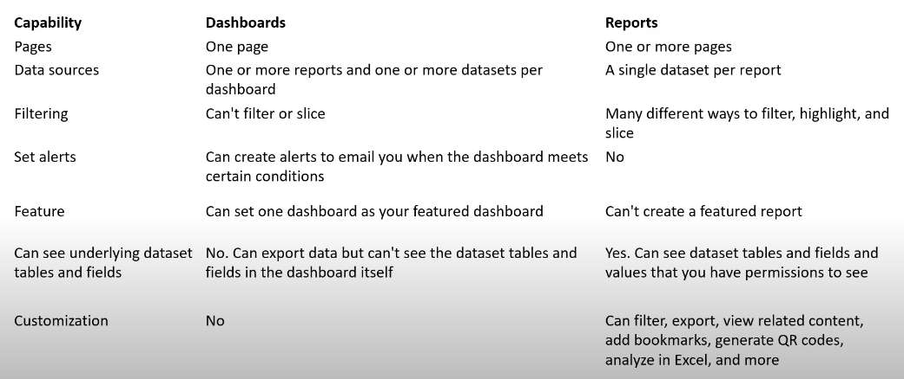

- [Apache Hadoop](#apache-hadoop)
- [Apache Kafka](#apache-kafka)
- [Apache Spark](#apache-spark)
  - [RDD API](#rdd-api)
- [Apache Tinkerpop](#apache-tinkerpop)
- [Azure Cosmos DB](#azure-cosmos-db)
  - [Cosmos DB Explorer](#cosmos-db-explorer)
- [Azure Data Factory](#azure-data-factory)
- [Azure Databricks](#azure-databricks)
  - [Databricks](#databricks)
  - [Azure Databricks Workspace](#azure-databricks-workspace)
  - [Azure Databricks SQL Analytics](#azure-databricks-sql-analytics)
- [Azure Data Lake](#azure-data-lake)
- [Azure Data Lake Analytics](#azure-data-lake-analytics)
  - [U-SQL](#u-sql)
- [Azure Elastic Pools](#azure-elastic-pools)
- [Azure HDInsights](#azure-hdinsights)
  - [Apache Ambari](#apache-ambari)
- [Azure SQL Family](#azure-sql-family)
  - [SQL Server on Azure Virtual Machines](#sql-server-on-azure-virtual-machines)
  - [SQL Managed Instance](#sql-managed-instance)
  - [Azure SQL Database](#azure-sql-database)
- [Azure Storage Accounts](#azure-storage-accounts)
  - [Azure Blob Storage](#azure-blob-storage)
    - [Access tiers](#access-tiers)
  - [Azure Files](#azure-files)
    - [Azure Storage Explorer](#azure-storage-explorer)
  - [Azure Table](#azure-table)
  - [Account Storage Azure Table vs Cosmos DB Table API](#account-storage-azure-table-vs-cosmos-db-table-api)
- [Azure Synapse Analytics](#azure-synapse-analytics)
- [Citus (HyperScale)](#citus-hyperscale)
  - [Synapse SQL](#synapse-sql)
  - [Synapse ELT](#synapse-elt)
- [Polybase](#polybase)
- [Power BI](#power-bi)
  - [Data Visualization](#data-visualization)
  - [Power BI Embedded](#power-bi-embedded)
  - [Power BI Interactive Reports](#power-bi-interactive-reports)
  - [Power BI Service](#power-bi-service)
  - [Reports vs Dashboards](#reports-vs-dashboards)
  - [Paginated Reports](#paginated-reports)

# Apache Hadoop

> Open-source framework for distributed processing of large data sets

* Distribute large datasets across many services (HDFS)
* Distribute computing queries across servers (MapReduce)

Components:

* Hadoop Common
* Hadoop Distributed File System (HDFS)
* Hadoop MapReduce
* Hbase
* YARN
* HIVE
* PIG

# Apache Kafka

> Open-source streaming platform to create high-performance pipelines, streaming analytics, data integration and mission-critical applications

* __Producers__ publish messages in a key and value format to a __Topic__
* __Consumers__ can listen for messages from a __Topic__ and consume them

# Apache Spark

> Open-source unified analytics engine for big data and machine learning

* Much faster than Hadoop
* Analytics ecosystem

Components:

* Spark Core
* Spark SQL
* Spark Streaming
* GraphX
* MLib

## RDD API

> Resilient Distributed Dataset is a DSL to execute various parallel operations on an Apache Spark Cluster

# Apache Tinkerpop

> Graphing computing framework for both graph databases (OLTP) and graph analytic systems (OLAP)

* Vendor-agnostic distributed framework to traverse different graph systems
  * Amazon Neptune
  * CosmosDB
  * Hadoop (Spark)
  * Neo4j
  * OrientDB
  * Titan
* Gremlin
  * Single language used for all graph systems
  * Azure CosmosDB supports this language by default

# Azure Cosmos DB

> A service for fully managed NoSQL databases, designed to scale and high performance

Cosmos DB supports different kinds of NoSQL database engines:

* Core SQL (document datastore)
* Azure Cosmos DB API for MongoDB (document datastore)
* Azure Table (key/value datastore)
* Gremlin (graph datastore, based on TinkerPop)

## Cosmos DB Explorer

> Web Interface to explore Cosmos DB accounts

# Azure Data Factory

* Define and schedule data pipelines to transfer and transform data
* Integrate pipelines with other Azure services
* Ingest data from cloud, process and persist in another data store

# Azure Databricks

> Partnership between Microsoft and Databricks to offer the Databricks Platform within the Azure Portal running on Azure compute services

## Databricks

> A software company specializing in providing fully managed Apache Spark clusters

Main offerings:

* Databricks platform
  * Available in AWS, Azure, GCP
* Databricks Community Edition

## Azure Databricks Workspace

> Integrations to Azure data-related services

* Batching: Azure Data Factory
* Streaming: Apache Kafka Event Hub
* Storage: Azure Blob Storage or Azure Data Lake Storage

## Azure Databricks SQL Analytics

* Run SQL queries on Datalake
* Create multiple visualization types
* Build and share dashboards

# Azure Data Lake

> Centralized data repository for unstructured data and semi-structured data

* Collect from various data sources
* Transform using ELT/ETL engines
* Distribute across various programs or APIs
* Publish datasets to meta catalogs for analysts
* Designed to handle petabytes of data and hundreds of gigabits of throughput
* Hierarchical namespace to efficiently access data to Azure Blob Storage

# Azure Data Lake Analytics

> On-demand analytics job service

Instead of deploying, configuring and tuning hardware, you write queries (via U-SQL) to transform data and extract valuable insights

## U-SQL

* Query and combine data from a variety of data sources
  * Azure Data Lake Storage
  * Azure Blob Storage
  * Azure SQL DB
  * Azure SQL Data Warehouse
  * SQL Server instances running in Azure VMs

# Azure Elastic Pools

> A cost-effective solution for managing and scaling multiple databases that have varying and unpredictable usage demands

* Single server
* Share a set number of resources at a set price

# Azure HDInsights

> Managed service to run popular open-source analytics service

Frameworks:

* Apache Hadoop
* Apache Spark
* Apache Kafka
* Apache Storm
* Apache Hive
* Apache HBase
* LLAP
* R

Use cases:

* ETL
* Data Warehousing
* Machine Learning
* IoT

## Apache Ambari

> Open-source Hadoop management web-portal for provisioning, managing and monitoring Apache Hadoop clusters

# Azure SQL Family

## SQL Server on Azure Virtual Machines

> IaaS

* When you need OS-level control and access
* Lift-and-shift workloads to the cloud
* When having existing SQL licenses

## SQL Managed Instance

> PaaS

* Modernize existing database
* Highly available, disaster recovery and automated backups
* Ideal for most migrations to the cloud

## Azure SQL Database

> PaaS

* Fully managed SQL databases
* Designed to be fault-tolerant
* Built-in disaster recovery
* Highly available
* Designed to scale
* __SQL Servers__: The underlying servers for Azure SQL Database

# Azure Storage Accounts

> An umbrella service for various forms of managed storage

## Azure Blob Storage

> Optimized for storing massive amounts of unstructured data

* Block blobs
* Append blobs
* Page blobs

### Access tiers

| Hot | Cool | Archive |
| --- | ---- | ------- |
| Frequently accessed | Infrequently accessed | Rarely accessed |
| High storage cost | Lower storage cost | Lowest storage cost |
| Low access cost | High access cost | High latency, up to hours |

## Azure Files

> Managed file share in the cloud

* Centralized server for storage that allows a big shared drive across VMs
* __Mounting__: when the connection with the shared file system is established, a new folder is mounted on the directory tree
* Uses SMB and NFS networking protocols
* Fully managed and resilient
* Scripting and tooling to automate the management and creation, using Azure API or PowerShell

### Azure Storage Explorer

A desktop app that allows you to connect and manage Azure Storage service accounts and resources across subscriptions and organizations

## Azure Table

> NoSQL Key/Value datastore

* __Partition Key__ unique identifier for the partition within a given table
* __Row Key__ unique identifier for an entity within a given partition
* Query along the Partition and Row Key

## Account Storage Azure Table vs Cosmos DB Table API

# Azure Synapse Analytics

> A data warehouse and unified analytics platform

It is a __Data Lakehouse__ for bringing data integration tools and big data analytics.

* Build ETL or ELT processes
* Ingest data from more than 95 data sources
* Integrated Apache Spark
* T-SQL for queries on data, warehouse and Spark engines
* Multi-language support: T-SQL, Python, Scala, Sparks SQL and .Net
* Integrated AI and BI
  * Azure ML Studio
  * Azure Cognito Services
  * Microsoft Power BI
* Integration with Apache Spark

# Citus (HyperScale)

> Postgres extension that transforms it into a distributed database

* Database sharding (horizontal scaling)
* Realtime queries (real-time analytics dashboards)
* Multi-tenancy
* Time series workloads

## Synapse SQL

A distributed version of T-SQL designed for data warehouse workloads.

* Extends T-SQL to address streaming and machine learning scenarios
* Built-in streaming to load data from cloud data sources into SQL tables
* Integrated AI with SQL by using ML models to score data using the `PREDICT` function
* __Serverless__ and __dedicated resource__ models
  * Serverless: unpredictable workloads
  * Dedicated SQL pools: predictable workloads

## Synapse ELT

> Perform ELT using Synapse SQL

# Polybase

> Data virtualization feature for SQL Server

* Allows SQL Server to query data with T-SQL directly from other sources without separately installing client connection software
  * SQL Server
  * Oracle
  * Teradata
  * MongoDB
  * Hadoop Clusters
  * Cosmos DB

# Power BI

[Business Intelligence](../../texts/bi.md)

> Tool for Visualization business data

* Can ingest data from many sources
* Integrate with Azure Services

Different components

* Power BI Desktop
* Power BI Mobile
* Power BI Service
* Power BI Embedded

## Data Visualization

* Bar and column
* Line
* Matrix
* Key influencer
* Treemap
* Scatter
* Bubble
* Dot plot
* Filled map

## Power BI Embedded

> PaaS analytics embedding solution that allows visuals, reports and dashboards to be embedded into an application

## Power BI Interactive Reports

> Interactive reports

* Sliders, knobs, buttons, etc
* Modify the underlying data models for a report

## Power BI Service

* Cloud-based service
* Create and interact with reports and Dashboards
* Dashboard Tiles
  * Snapshot of data pinned to the dashboard
* Dashboard
  * A single page, often called canvas

## Reports vs Dashboards

## Paginated Reports

> Reports designed to fit into a page format so they can be printed or shared
>
> The date is displayed as tables which can span multiple pages

* Report Definition Language (RDL)
  * XML representation of a SQL Server Reporting Services report definition
  * Contains data retrieval and layout information for a report
* Power BI Report Builder
  * Design pixel-perfect paginated reports
