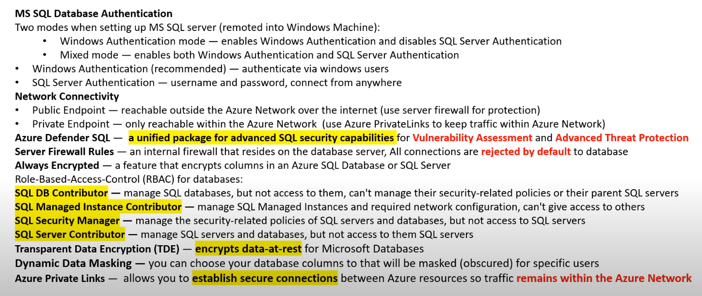

- [DP-900](#dp-900)
- [Core Data Concepts](#core-data-concepts)
  - [Data-Related Azure Services](#data-related-azure-services)
  - [Roles](#roles)
  - [Data Overview](#data-overview)
- [Data Documents](#data-documents)
  - [Data Type](#data-type)
  - [Data Structures](#data-structures)
  - [Unstructured](#unstructured)
  - [Semi-structured](#semi-structured)
  - [Structured](#structured)
  - [Datasets](#datasets)
  - [Notebooks](#notebooks)
- [Concepts](#concepts)
  - [Batch vs Stream Processing](#batch-vs-stream-processing)
  - [Relational Data](#relational-data)
    - [Relationships](#relationships)
  - [Schema vs Schemaless](#schema-vs-schemaless)
  - [Query and Querying](#query-and-querying)
    - [Row-store vs Column-store](#row-store-vs-column-store)
    - [Database Indexes](#database-indexes)
  - [Data Integrity vs Data Corruption](#data-integrity-vs-data-corruption)
  - [Normalized vs Denormalized](#normalized-vs-denormalized)
  - [Pivot Table](#pivot-table)
  - [Strongly Consistent vs Eventually Consistent](#strongly-consistent-vs-eventually-consistent)
  - [Synchronous vs Asynchronous](#synchronous-vs-asynchronous)
  - [Non Relational Data](#non-relational-data)
- [Data Mining](#data-mining)
- [Data Wrangling](#data-wrangling)
- [Data Modeling](#data-modeling)
- [ETL vs ELT](#etl-vs-elt)
- [KPI](#kpi)
- [Data Analytics](#data-analytics)
- [Microsoft One Drive vs SharePoint](#microsoft-one-drive-vs-sharepoint)
- [Database Security](#database-security)
  - [Connection Policy](#connection-policy)
  - [Database Authentication](#database-authentication)
    - [Windows Authentication](#windows-authentication)
    - [SQL Server Authentication](#sql-server-authentication)
  - [Network Connectivity](#network-connectivity)
  - [Azure Defender for SQL](#azure-defender-for-sql)
  - [Azure Database Firewalls Rules](#azure-database-firewalls-rules)
  - [Always Encrypted](#always-encrypted)
  - [Role-Based Access Controls](#role-based-access-controls)
    - [Role Assignment](#role-assignment)
    - [Scopes](#scopes)
  - [Transparent Data Encryption](#transparent-data-encryption)
  - [Dynamic Data Masking](#dynamic-data-masking)
  - [Private Links](#private-links)
- [Relational Databases](#relational-databases)
- [T-SQL](#t-sql)
- [ELT and SQL Tools](#elt-and-sql-tools)
- [Data Redundancy](#data-redundancy)
- [CheatSheets](#cheatsheets)

# DP-900

> Microsoft Azure Data Fundamentals

Links

* [Certifications](https://learn.microsoft.com/en-us/certifications/azure-data-fundamentals/)
* [Exam](https://learn.microsoft.com/en-us/certifications/exams/dp-900)
* [Study Guide](https://query.prod.cms.rt.microsoft.com/cms/api/am/binary/RE4wsKZ)
* [Sample Questions](https://learn.microsoft.com/en-us/certifications/resources/dp-900-sample-questions)

Sources to studies

* [freeCodeCamp](https://www.youtube.com/watch?v=P3qmqUZJ7l0)
* [John Savill](https://www.youtube.com/watch?v=0gtpasITVnk)

# Core Data Concepts

## Data-Related Azure Services

[Text](../azure_services.md)

* Azure Storage Accounts
* Azure Blob Storage
* Azure Tables
* Azure Files
* Azure Storage Explorer
* Azure Synapse Analytics
* Cosmos DB
* Azure Data Lake Store
* Azure Data Analytics
* Azure Data Box

## Roles

* Database Administrator
  * Configures and maintains a database
* Data Engineer
  * Design and maintain data tasks
* Data Analyst
  * Analyzes business data

## Data Overview

* __Data__ - units of information
* __Data Documents__ - types of abstract groupings and data
* __Data Sets__ - unstructured logical grouping of data
* __Data Structures__ - structured data
* __Data Types__ - how single units of data are intended to be used

# Data Documents

[More about data storage here](data_storage.md)

A data document defines the collective form in which data exists

## Data Type

A single unit of data that describes how the data is intended to be used

* Numeric
  * Integer
  * Float (Decimal)
* Text Data Types
  * Character
  * String
* Composite
  * Array
  * Hash (Dictionary)
* Binary
* Boolean
* Enumeration

## Data Structures

>Data that is organized in a specific format for easy access and modification

* Unstructured
  * Microsoft Sharepoint
  * Azure Blob Storage
  * Azure Files
  * Azure Data Lake
* Semi-structured
  * Azure Tables
  * Azure Cosmos DB
  * Mongo DB
  * Apache Cassandra
* Structured
  * Postgres
  * MySQL
  * Azure SQL
  * Azure Synapse Analytics

## Unstructured

>Files in a folder, with random files and folders

* Loose data
* Not optimized for search or analysis

## Semi-structured

>JSON and XML files

* Has no schema
* Has some form of relationship
* Has limitations on search
* Has fields but...
  * Don`t have to be the same in every entity
  * Are only defined when needed depending on the entity

File formats

* JSON (JavaScript Object Notation)
  * Easy for humans to read and write
  * Easy parsing and generation
* ORC (Apache Optimized Row Columnar)
  * Columnar reads, predictive pushdown and lazy reads
  * Organized in stripes of data (up to 250 MB)
  * File footer, stripe footer, raw data, index data
* Parquet
  * Columnar storage
  * Efficient compression and encoding schemes
  * Record shredding and assembly algorithm
* AVRO
  * Row-based
  * Compact, fast, binary data format
  * Container file
  * RPC

## Structured

>Relational database

* Has a schema
* Has relationships
* Easy to search for related data
* Most common is tabular data

## Datasets

*MNIST Dataset*

>A logical grouping of data

## Notebooks

*Jupyter Notebook*

>Data that is arranged in pages, designed for easy consumption

# Concepts

* Batch and Streaming Data
* Relational and Non Relational
* Data Modelling
* Schema and Schemaless
* Data Integrity and Data Corruption
* Normalized and Denormalized

## Batch vs Stream Processing

[Text](../../texts/batch_vs_stream_processing.md)

## Relational Data

* __Tables__ logical grouping of rows
* __Views__ result set of a stored query on data stored in memory (temporary table)
* __Materialized Views__ result set stored query on data stored on disk
* __Indexes__ copy of the data sorted by one or multiple columns for faster reads at the cost of storage
* __Constraints__ rules applied to writes, that can ensure data integrity
* __Triggers__ a function that is triggered on a specific database event
* __Primary Key__ a column which holds the value of the primary key from another key to establish a relationship

### Relationships

* One-to-one
* One-to-many
* Many-to-many
* Many-to-many via a junction table

## Schema vs Schemaless

A schema is a formal language which describes the structure of data and can define many different data structures, serving different purposes.

It is schemaless when the cell can accept many data types, allowing developers to forgo upfront data modelling.

## Query and Querying

A query is a request for data results (reads) to perform operations like inserting, updating or deleting data (writes).

* Query
* Data Result
* Querying
* Query Language

### Row-store vs Column-store

* __Row-store__
  * Traditional relational databases
  * Good for general purpose databases
  * Suited for Online transaction processing
  * Not the best at analytics or massive amounts of data
* __Column-store__
  * Faster at aggregating values at analytics
  * Usually NoSQL-like databases
  * Good for vast amount of data
  * Suited for Online analytical processing

### Database Indexes

Improves the speed of reads from the table by storing redundant data (usually a B-Tree in disk).

## Data Integrity vs Data Corruption

* __Data integrity__ is the maintenance and assurance of data accuracy and consistency over its entire life-cycle.
* __Data corruption__ is the act or state of data not being in the intended state that will result in data loss or misinformation

## Normalized vs Denormalized

* __Normalized__ A schema designed to store non-redundant and consistent data
  * Data integrity is maintained
  * Little redundant data
  * Many tables
  * Optimized storage
* __Denormalized__ A schema that combines data so that accessing data is fast
  * Data integrity is not maintained
  * Redundant data is common
  * Fewer tables
  * Storage is less optimal

## Pivot Table

A table of statistics that summarizes (by __aggregation__) the data of a more complex extensive table. Used in data processing to draw attention to useful information and find figures and facts quickly.

## Strongly Consistent vs Eventually Consistent

* __Strongly Consistent__ means that every time you request data, you can expect consistent data to be return within `x` time, possible seconds or more
* __Eventually Consistent__ means that when you request data, you may get inconsistent data, but it will eventually be consistent

## Synchronous vs Asynchronous

* __Synchronous__ continuous stream of data that is synchronized by a timer (guarantee of time)
* __Asynchronous__ continuous stream of data separated by start and stop bits (no guarantee of time)

## Non Relational Data

Non-tabular form and optimized for different data structures

* Key/Value
* Document
* Columnar
* Graph
* A combination of these

# Data Mining

[Text](../../texts/data_mining.md)

# Data Wrangling

>Process of transforming and mapping data from one raw data form into another format with the intent of making it more appropriate and valuable for other purposes

1. Discovery
2. Structuring
3. Cleaning
4. Enriching
5. Validating
6. Publishing

# Data Modeling

[Text](../../texts/data_modeling.md)

# ETL vs ELT

[Text](../../texts/etl_vs_elt.md)

# KPI

[Text](../../texts/kips.md)

# Data Analytics

[Text](../../texts/data_analytics.md)

# Microsoft One Drive vs SharePoint

* One Drive: for a single user
* SharePoint: for an organization

# Database Security

## Connection Policy

* __Redirect__
  * Clients establish connections directly to the node hosting the database
  * Reduced latency and improved throughput
* __Proxy__
  * All connections are proxied via the Azure SQL Database gateways
  * Increased latency and reduced throughput
  * Outbound communication on port 1433
* __Default__
  * Default connection policy when a server is created
  * Uses Redirect for all client connections inside of Azure
  * Uses Proxy for all client connections outside of Azure

## Database Authentication

* __Windows Authentication Mode__
  * Enables Windows Authentication and disables SQL Server Authentication
* __Mixed Mode__
  * Enables both Windows Authentication and SQL Server Authentication

### Windows Authentication

* Recommended
* Specific user and group accounts are trusted to log in to SQL Server
* Secure and fast to modify or revoke access

### SQL Server Authentication

* Username and password, stored on the primary database
* Cannot use Kerberos security protocol
* Easier to connect from outside domain or from a web-based interface

## Network Connectivity

* Public Endpoints
  * Reachable outside the Azure Network over the internet
  * Use Firewall rules to project the database
* Private Endpoints
  * Use Azure Private Link to keep traffic within the Azure Network

## Azure Defender for SQL

> Unified package for advanced SQL security capabilities
>
> Vulnerability Assessment and Advanced Threat Protection

Available for:

* Azure SQL Database
* Azure SQL Managed Instance
* Azure Synapse Analytics

## Azure Database Firewalls Rules

> Server firewall that resides on the database server

* Rejects all connections by default
* Can set firewall rules via T-SQL

## Always Encrypted

> Encrypts columns in an Azure SQL Database or SQL Server

* __Column encryption keys__ is used to encrypt data in a column
* __Column master keys__ encrypts one or more column encryption keys

## Role-Based Access Controls

> Apply roles to grant users fine-grade actions for specific Azure services

* __SQL DB Contributor__
  * Manage SQL databases but not access them, but can`t manage security related policies
* __SQL Managed Instance Contributor__
  * Manage SQL Managed Instances and required network configuration, but can`t give access to others
* __SQL Security Manager__
  * Manage security-related policies of SQL servers and databases but no access to SQL servers
* __SQL Server Contributor__
  * Manage SQL servers and databases

### Role Assignment

* Role definition (create VM, delete SQL, assign permissions)
* Security principal (user, group, service principal)
* Scope

### Scopes

> Scopes are hierarchical

1. Management Group
2. Subscription
3. Resource Group
4. Resource

## Transparent Data Encryption

> Encrypts data-at-rest for Microsoft Databases

* TDE does real-time I/O encryption and decryption of data and log files
* Encryption uses a Database Encryption Key (DEK)

## Dynamic Data Masking

> Request for data is transformed to mask sensitive data

* SQL users excluded from masking
* Masking rules
* Masking functions (how to apply masking to fields)

## Private Links

> Establish secure connections between Azure resources so traffic remains within the Azure Network

# Relational Databases

[Text](../../texts/relational_dbs.md)

# T-SQL

[Text](../../texts/tsql.md)

# ELT and SQL Tools

* SQL Server Management Studio (SSMS)
* SQL Server Data Tool (SSDT)
* Azure Data Studio
* Azure Data Factory
  * Data flows: logic to determine how data moves through a pipeline or is transformed
  * Control flow: orchestration of pipeline activities that includes chaining activities in a sequence or branching
* SQL Server Integration Services SSIS

# Data Redundancy

* LRS (Locally Redundant Storage)
  * Copies data synchronously three times within a single physical location in the primary region
* ZRS (Zone-Redundant Storage)
  * Copies data synchronously across three Azure availability zones in the primary region
* GRS (Geo-Redundant Storage)
  * Copies data synchronously three times within a single physical location in the __primary region__ using __LRS__, then copies data asynchronously to a single physical location in a __secondary region__ three times using __LRS__
* GZRS (Geo-Zone-Redundant Storage)
  * Copies data synchronously across three Azure availability zone in the __primary region__ using __ZRS__, then copies data asynchronously to a single physical location in the __secondary region__ using __LRS__

For GRS and GZRS, it is not possible to read or write data from the secondary region. The RPO (Recovery Point Objective) is less then 15, although there is no SLA stating this.

* RA-GRS is like GRS but with read/write access to the secondary region
* RA-GZRS is like GZRS but with rea/write access to the secondary region

# CheatSheets

