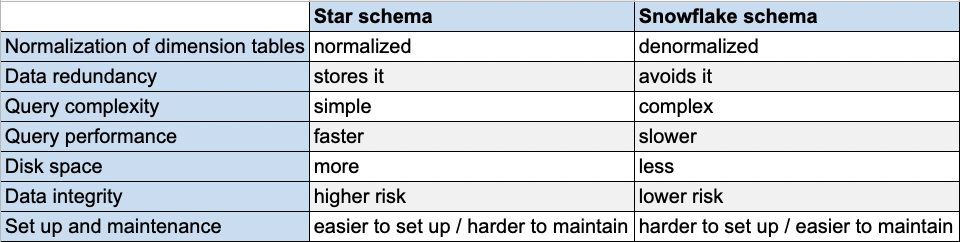

# Data Modeling

[Source](https://powerbi.microsoft.com/en-us/what-is-data-modeling/)

>Define and analyze the data requirements needed to support the business process

## Data Model

>Organizes elements of data and standardizes how they relate to one another

* Analyze and define the data that the business collects and produces
* Relationships between the data
* Create visual representations of data as it’s used at the business
* Exercise the understanding and clarification of data requirements

## Types of data modeling

* Conceptual
  * How data is represented at the organization level
* Logical
  * How data is represented in software
* Physical
  * How data is physically stored

### Conceptual data modeling

A conceptual data model defines the overall structure of your business and data. It’s used for organizing business concepts, as defined by your business stakeholders and data architects. For instance, you may have customer, employee, and product data, and each of those data buckets, known as entities, has relationships with other entities. Both the entities and the entity relationships are defined in your conceptual model.

### Logical data modeling

A logical data model builds on the conceptual model with specific attributes of data within each entity and specific relationships between those attributes. For instance, Customer A buys Product B from Sales Associate C. This is your technical model of the rules and data structures as defined by data architects and business analysts, and it will help drive decisions about what physical model your data and business needs require.

### Physical data modeling

A physical data model is your specific implementation of the logical data model, and it’s created by database administrators and developers. It is developed for a specific database tool and data storage technology, and with data connectors to serve the data throughout your business systems to users as needed. This is the “thing” the other models have been leading to—the actual implementation of your data estate.

## Fact Tables and Dimension Tables

* Fact Tables
  * Record measurements or metrics for a specific event
  * Generally consist of numeric values and foreign keys to dimensional data where descriptive information is kept
  * Designed to a low level of uniform detail
* Dimension Tables
  * Usually have a relatively small number of records compared to fact tables, but each record may have a very large number of attributes to describe the fact data
  * Can define a wide variety of characteristics, but some of the most common attributes defined by dimension tables include: time, geography, range, product, etc

## Star Schema vs Snowflake Schema

* [__Star Schema__](https://en.wikipedia.org/wiki/Star_schema)
  * De-normalized
  * One fact table
  * Multiple dimension tables
  * Worse for analytics due to possible inconsistencies
* [__Snowflake Schema__](https://en.wikipedia.org/wiki/Snowflake_schema)
  * Normalized
  * One fact table
  * Multiple dimension tables
  * Each dimension table can have other dimensions
  * Better for analytics
